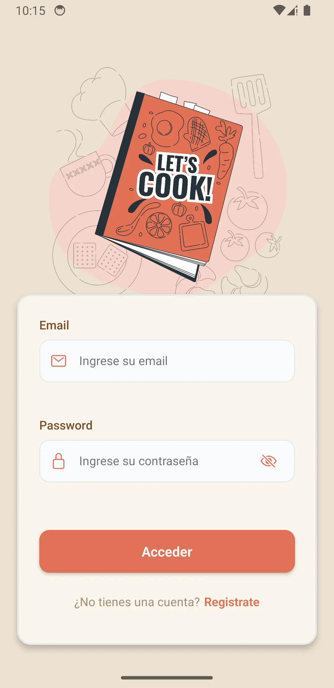
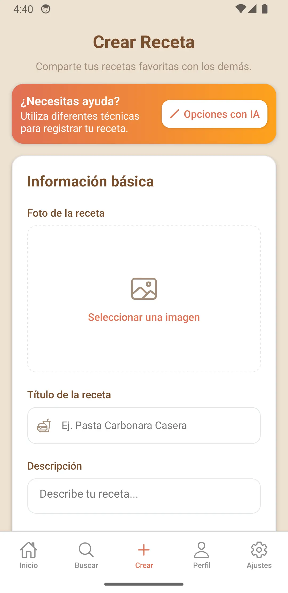
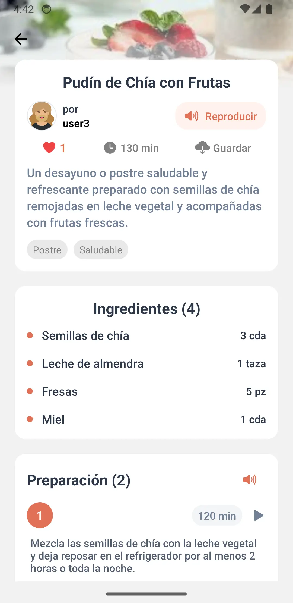
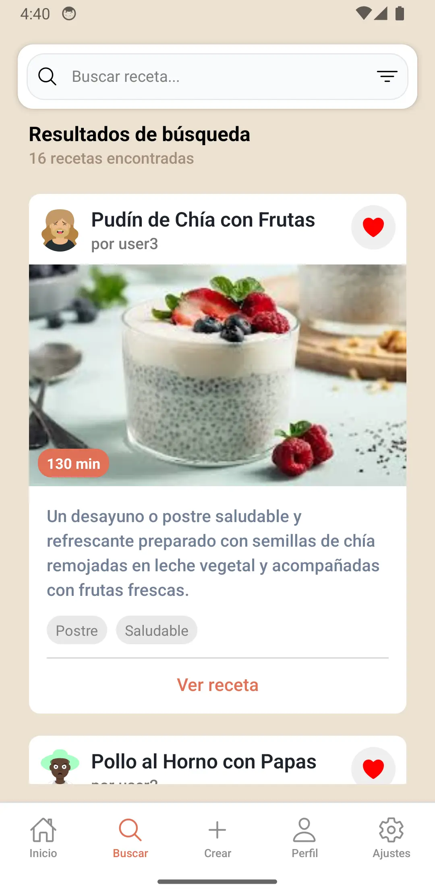
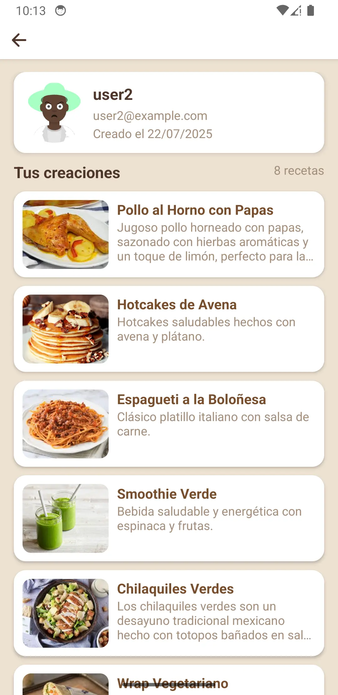

# 🍳 Recipe App

Aplicación móvil desarrollada con **React Native (Expo)** y **Node.js/Express** para gestionar recetas de cocina.  
Permite a los usuarios explorar, guardar, escuchar y compartir recetas de manera sencilla.

---

## ✨ Características principales

- 🔐 **Autenticación segura** con JWT y almacenamiento en `AsyncStorage`.
- 👤 **Perfiles de usuario**: consulta de recetas creadas por cada usuario.
- 📑 **Gestión de recetas**: creación, listado, filtrado y paginación infinita.
- ❤️ **Favoritos**: sistema de favoritos persistente con `zustand + persist`.
- 🔊 **Narración de recetas** con **Text-to-Speech**:
  - Reproducir receta completa (título, descripción, ingredientes y pasos).
  - Reproducir solo los pasos.
  - Reproducir un paso individual.
  - Controles de **pausa/reanudar** y **detener**.
- ⚙️ **Configuraciones personalizables** (por ejemplo, tomar en cuenta la duración de los pasos).
- 📱 **UI optimizada**: componentes reutilizables, diseño limpio y navegación fluida.

---

## 🛠️ Tecnologías principales utilizadas

### Frontend

- [React Native](https://reactnative.dev/) (con [Expo](https://expo.dev/))
- [Zustand](https://github.com/pmndrs/zustand) (manejo de estado global)
- [AsyncStorage](https://react-native-async-storage.github.io/async-storage/) (persistencia local)
- [Expo Speech](https://docs.expo.dev/versions/latest/sdk/speech/) (narración TTS)

### Backend

- [Node.js](https://nodejs.org/)
- [Express](https://expressjs.com/)
- [MongoDB](https://www.mongodb.com/)
- [Mongoose](https://mongoosejs.com/)

---

## 📷 Capturas de pantalla

  
 
 

---

## 🚀 Instalación y ejecución

### Backend

1. Descargar el proyecto desde el [repositorio](https://github.com/Alba2809/react-native-smartchef-api).

```bash
git clone https://github.com/Alba2809/react-native-smartchef-api
```

2. Instalar las dependencias.

```bash
npm install
```

3. Iniciar el servidor.

```bash
npm run start
```

### Frontend

1. Descargar el proyecto desde el repositorio.

```bash
git clone https://github.com/joseluisgs/SmartChef_ReactNative.git
```

2. Instalar las dependencias.

```bash
cd frontend
npm install
```

3. Iniciar el proyecto. (android)

```bash
expo start --android
```

---

## Variables de entorno

En el `backend`, crear un archivo `.env` con las siguientes variables:

```bash
MONGO_URL=...
GEMINAI_KEY=...
CLOUDINARY_CLOUD_NAME=...
CLOUDINARY_API_KEY=...
CLOUDINARY_API_SECRET=...
```

En el `frontend`, configurar la variable de la API `API_URL`, ubicada en `constants/api.js`:

```bash
API_URL=<url-del-backend>
```

---

## 📌 Próximas mejoras

- 📲 Notificaciones push para recordatorios de recetas.
- 🌎 Multilenguaje para la narración de recetas.
- 🖼️ Soporte para imágenes y videos en los pasos.
- 🔎 Búsqueda avanzada por ingredientes y categorías.
- 📱 Mejoras en la experiencia de dispositivos móviles.
- 🤖 Agregar funcionalidades adicionales a la IA.
- 📝 Verificación de correos.
- ⚙️ Agregar opciones de configuración.

---

## 📝 Licencia

Este proyecto está licenciado bajo la licencia MIT.
